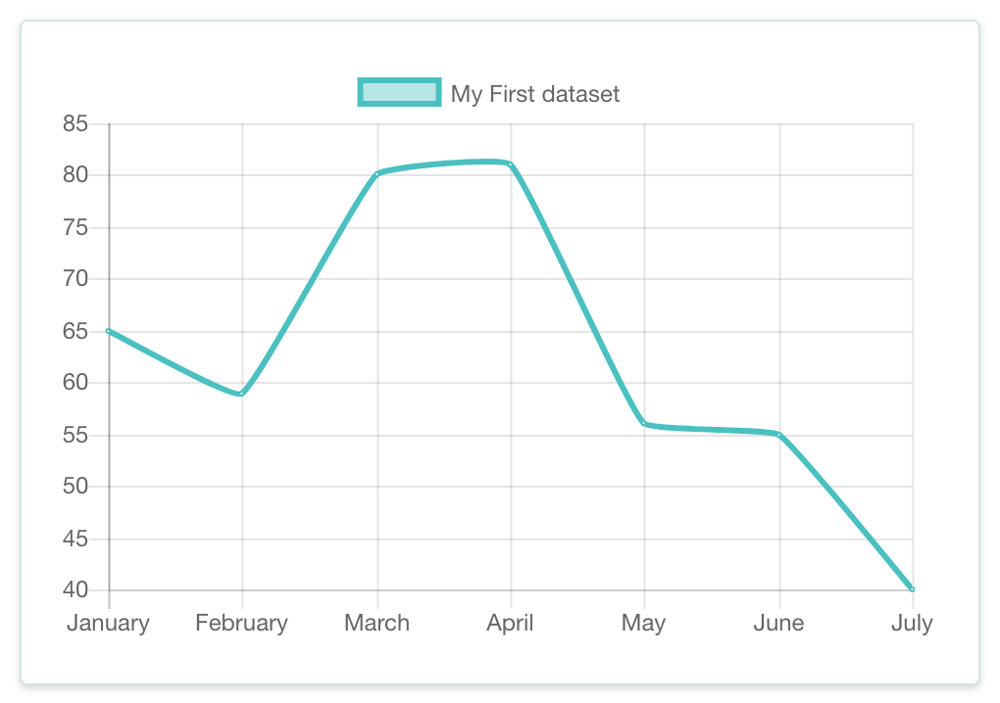
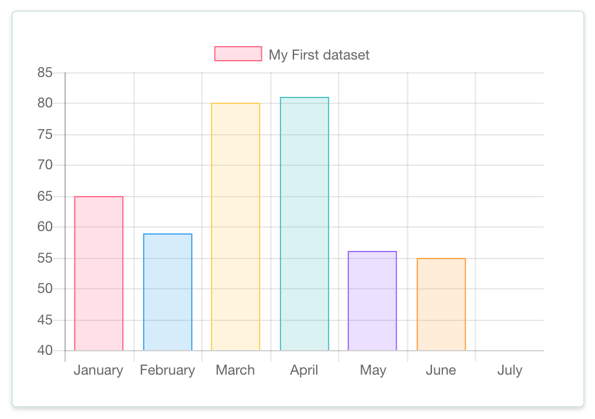
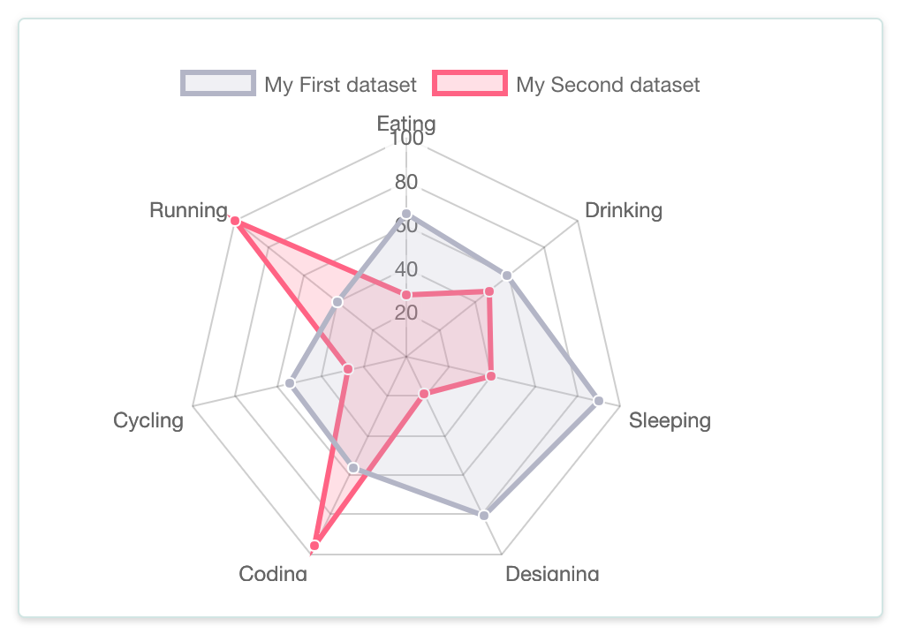
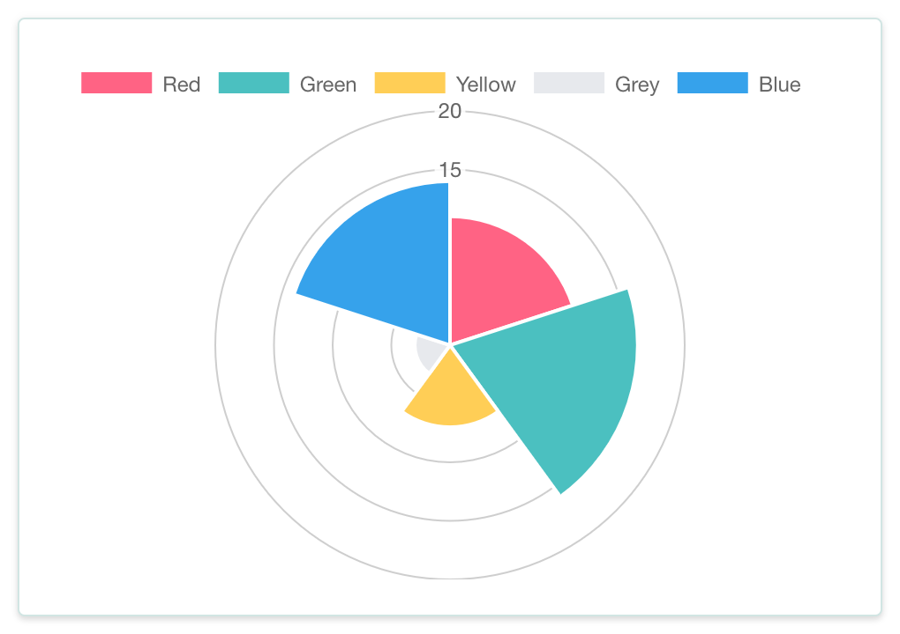
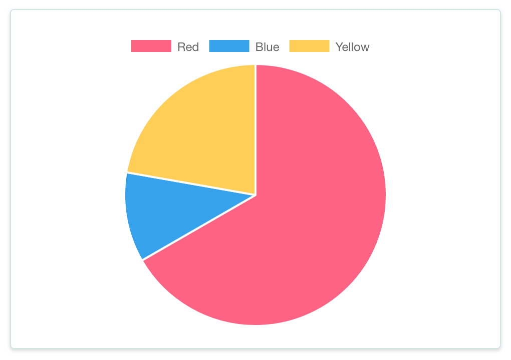
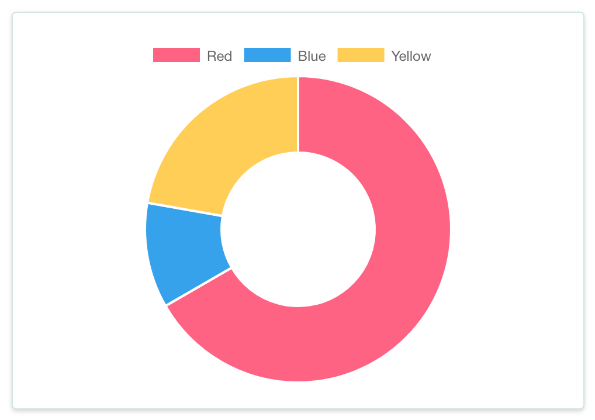
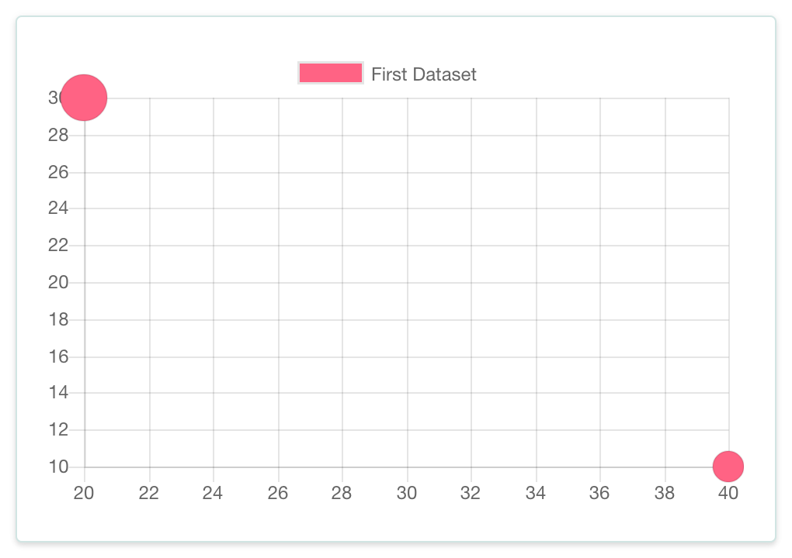

# ChartJS-VUE
> 基于ChartJS的Vue单文件组件

## 使用方法

1、 确保项目中已经安装了chart.js
如果没有安装，请执行：
``` bash
npm install chart.js --save
```
2、在需要引用图表的页面中使用

***脚本***
``` javascript

<script>
import chartjs from '../plugins/chartjs'

export default{
  data () {
    return {
      currentDate: '2017-05-11 12:00',
      lineData: {
        labels: ['January', 'February', 'March', 'April', 'May', 'June', 'July'],
        datasets: [{ }]
      },
      pieData: {
        labels: ['Red', 'Blue', 'Yellow'],
        datasets: [{ }]
      },
      barData: {
        labels: ['January', 'February', 'March', 'April', 'May', 'June', 'July'],
        datasets: [{ }]
      },
      radarData: {
        labels: ['Eating', 'Drinking', 'Sleeping', 'Designing', 'Coding', 'Cycling', 'Running'],
        datasets: [{ }]
      },
      polarareaData: {
        datasets: [{ }],
        labels: ['Red','Green','Yellow','Grey','Blue']
      },
      bubbleData: {
        datasets: [{ }]
      },
      options: {
      }
    }
  },
  mounted () {
  },
  components: {
    chartjs
  }
}
</script>
```

***组件标签***
``` html
<chartjs :type="'line'" :data="lineData" :options="options" :height="200"></chartjs>
```

> 关于Chart.js的详细配置，请参考[官方文档](http://www.chartjs.org/docs/)

> 该组件可直接使用官方所给出的配置来使用

## 截图展示

### Line Chart


### Bar Chart


### Radar Chart


### Polar Area Chart


### Pie Chart


### Doughnut Chart


### Bubble Chart


## 待办事项
- [ ] 改为插件方式安装
